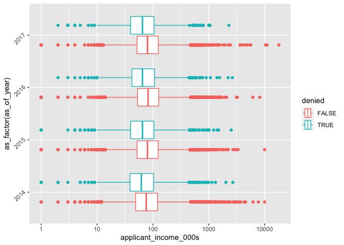

# Week 03 `dplyr` Activity
**\[\[**Your Name**\]\]**

## Home Mortgage Disclosure Act (HMDA) Data

This data is collected from the [Consumer Financial Protection
Bureau](https://www.consumerfinance.gov/data-research/hmda/historic-data/?geo=nationwide&records=all-records&field_descriptions=labels),
who give the following summary.

> Each year thousands of financial institutions report data about
> mortgages to the public, under the Home Mortgage Disclosure Act
> (HMDA). We provide the data collected under HMDA from 2007-2017 for
> download. For mortgage applications, the data will tell you if the
> consumer got the mortgage—look for applications that were
> “originated”—or if the consumer was denied, didn’t complete the
> application, or something else happened. The data also have
> information about pre-approvals and loans sold from one institution to
> another. For each record, you can learn about the loan, the property
> characteristics, the applicant demographics, and the lender. The data
> are modified to protect applicant and borrower privacy.

``` r
suppressPackageStartupMessages(library(tidyverse))
hmda_s <- read_rds("hmda_2014-17_sample_80k.rds") |>
  select(-agency_code)
unique_vals <- hmda_s |>
  summarize(a = across(where(is_character), \(f) list(unique(f)))) |>
  unnest(a) |>
  pivot_longer(everything()) |>
  filter(!(name %in% c("state", "county", "state_abbr", "msamd"))) |>
  unnest(value) |>
  group_by(value) |>
  slice_head(n = 1) |>
  arrange(name)
unique_vals
```

    # A tibble: 4,419 × 2
    # Groups:   value [4,419]
       name         value                                              
       <chr>        <chr>                                              
     1 action_taken Application approved but not accepted              
     2 action_taken Application denied by financial institution        
     3 action_taken Application withdrawn by applicant                 
     4 action_taken File closed for incompleteness                     
     5 action_taken Loan originated                                    
     6 action_taken Loan purchased by the institution                  
     7 action_taken Preapproval request approved but not accepted      
     8 action_taken Preapproval request denied by financial institution
     9 agency       Consumer Financial Protection Bureau               
    10 agency       Department of Housing and Urban Development        
    # ℹ 4,409 more rows

The table above has all the unique values for the different columns,
except for the location variables.

``` r
hmda_s |>
  mutate(denied = !is.na(denial_reason_1)) |>
  ggplot(aes(
    y = as_factor(as_of_year),
    x = applicant_income_000s,
    color = denied
  )) +
  geom_boxplot() +
  scale_x_log10() +
  scale_y_discrete(guide = guide_axis(angle = 45))
```

    Warning: Removed 11705 rows containing non-finite values (`stat_boxplot()`).



## Activity

I recommend iterating between 1, 2 and 3. The first question you ask
might be too complicated or too simple. Try to come up with an
interesting

1.  What question do you want to ask about the data?
2.  Use `dplyr` verbs make a table that tries to address the question.
3.  Make a plot using `dplyr` verbs and `ggplot` that tries to address
    the question.
4.  Describe your observation. If you feel you were able to answer your
    question, what is the answer?
5.  What were you unable to do that you think you could do with this
    data?
6.  What other data would you want to incorporate into this data?
